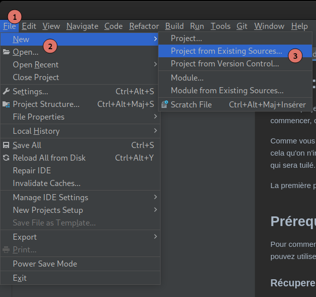
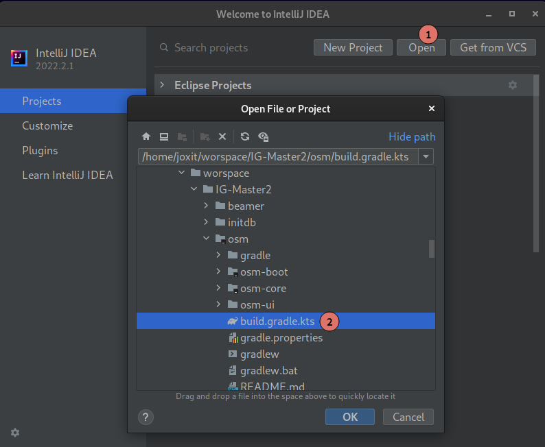
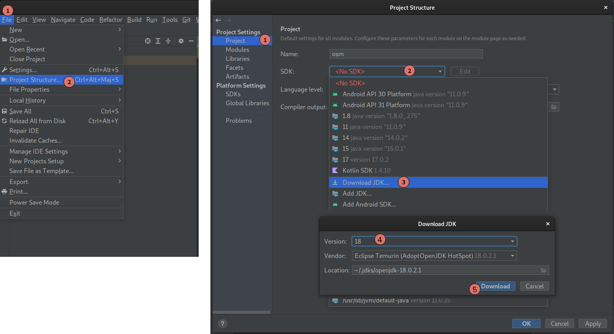
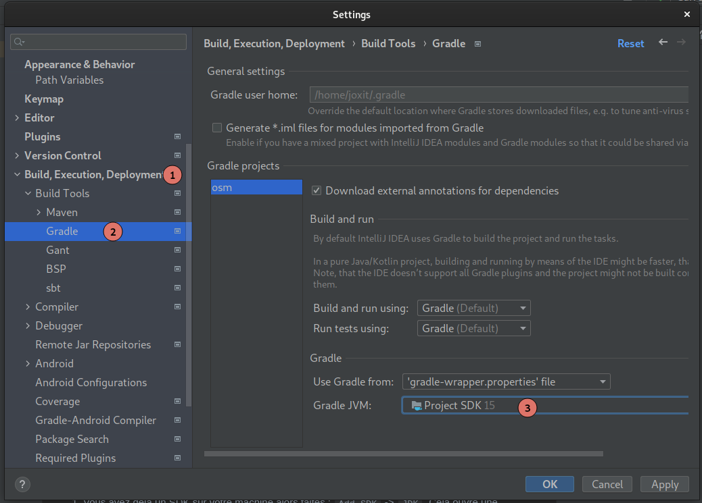
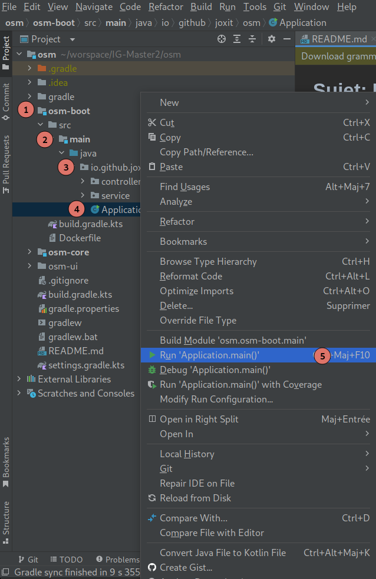

# Sujet: La cartographie avec OpenStreetMap

Dans ce projet, nous allons créer et utiliser des services autour de la cartographie digitale. Pour commencer, on va à la base de ces services : la carte.

Comme vous avez pu le voir pendant le cours, il n'est pas simple de gérer la donnée OSM, c'est pour cela qu'on n'ira pas jusqu'à posséder une base OSM. À la place, nous allons utiliser un SVG du monde qui sera tuilé. J'ai déjà créé le service de tuilage, vous n'aurez qu'à appeler cette méthode.

La première partie consiste à créer son serveur de tuiles. Il n'y aura pas de partie front lors de ce TP!

## Prérequis

Pour commencer vous devez déjà avoir [IntelliJ Idea Community ou Ultimate](https://www.jetbrains.com/idea/download/#section=linux) d'installé avec Java.
Vous pouvez utiliser d'autres IDE, mais je ne pourrais pas vous aider... (Non, Atom n'est pas un IDE...)

### Récuperer le code

Vous pouvez cloner le projet avec git `git clone https://github.com/Joxit/IG-Master2` ou télécherger le [zip](https://github.com/Joxit/IG-Master2/archive/master.zip).
Si vous vous vous êtes déjà servis de IntelliJ, cliquez sur `File` -> `New` -> `Project From Existing Sources`.



Sinon, sur la page de `Welcome to IntelliJ IDEA`, cliquez sur `Open`



Dans les deux cas, cela ouvre une fenêtre, naviguez jusqu'au projet et **selectionnez le fichier** `osm/build.gradle.kts` et ouvrez en tant que projet.
Cela ouvre une fenêtre avec le projet configuré avec Gradle.

Si vous n'avez pas Java de configuré, vous pouvez séléctionner le SDK à utiliser, pour cela cliquez sur `File` -> `Project Structure` -> `Project`. Vous verrez peut-être que vous verrez `<No SDK>`, cliquez dessus et selectionnez une version de Java (s'il y en a), sinon deux choix s'offrent à vous:

1. Vous avez déjà un SDK sur votre machine alors faites : `Add SDK` -> `JDK`. Cela ouvre une fenêtre, naviguez jusuq'à l'endroit où il y a votre JDK (essayez `/usr/lib/jvm/` pour linux ou dans les dossiers `Program Files/Eclipse Foundation` sous Windows).
2. Vous n'avez pas de SDK sur votre machine, alors faites : `Download JDK` -> `Eclipse Temurin` -> La dernière version disponible.



Vérifiez que le SDK utilisé par le projet est le même que celui qu'utilisera gradle. Pour cela allez dans `File` -> `Settings`. Cela ouvre une nouvelle fenêtre, sur la gauche séléctionnez `Build, Execution, Deployment` -> `Build Tool` -> `Gradle` et séléctionnez une version de JVM identique à celui du projet (verifiez que c'est positionné sur `Project SDK`).



Pour vérifier que tout fonctionne correctement, vous pouvez lancer le projet, sur la partie de gauche (Projet), ouvrez le projet `osm` -> `osm-boot` -> `src` -> `main` -> `java` -> `io.github.joxit.osm`. Faites un clique droit sur Application puis `Run Application.main()`.



Dès que vous avez dans la console quelque chose ressemblant à cela, c'est que votre serveur est démarré. Un [serveur](https://fr.wikipedia.org/wiki/Serveur_informatique) fournit donc des services à un ou plusieurs clients. Pour ce faire il doit resté démarré sans s'arrêter...
:warning: Donc **si vous voyez que ça ne bouge pas c'est totalement normal**... Il fait déjà son travail !

```
  .   ____          _            __ _ _
 /\\ / ___'_ __ _ _(_)_ __  __ _ \ \ \ \
( ( )\___ | '_ | '_| | '_ \/ _` | \ \ \ \
 \\/  ___)| |_)| | | | | || (_| |  ) ) ) )
  '  |____| .__|_| |_|_| |_\__, | / / / /
 =========|_|==============|___/=/_/_/_/
 :: Spring Boot ::        (v2.3.4.RELEASE)

2020-11-02 07:11:55.234  INFO 8 --- [           main] io.github.joxit.osm.Application          : Starting Application v1.0-SNAPSHOT on 333bac29f1ba with PID 8 (/usr/src/osm/osm-boot.jar started by root in /usr/src/osm)
2020-11-02 07:11:55.243  INFO 8 --- [           main] io.github.joxit.osm.Application          : No active profile set, falling back to default profiles: default
2020-11-02 07:11:55.385  WARN 8 --- [kground-preinit] o.s.h.c.j.Jackson2ObjectMapperBuilder    : For Jackson Kotlin classes support please add "com.fasterxml.jackson.module:jackson-module-kotlin" to the classpath
2020-11-02 07:11:56.844  INFO 8 --- [           main] o.s.b.w.embedded.tomcat.TomcatWebServer  : Tomcat initialized with port(s): 8080 (http)
2020-11-02 07:11:56.863  INFO 8 --- [           main] o.apache.catalina.core.StandardService   : Starting service [Tomcat]
2020-11-02 07:11:56.863  INFO 8 --- [           main] org.apache.catalina.core.StandardEngine  : Starting Servlet engine: [Apache Tomcat/9.0.38]
2020-11-02 07:11:56.955  INFO 8 --- [           main] o.a.c.c.C.[Tomcat].[localhost].[/]       : Initializing Spring embedded WebApplicationContext
2020-11-02 07:11:56.955  INFO 8 --- [           main] w.s.c.ServletWebServerApplicationContext : Root WebApplicationContext: initialization completed in 1557 ms
2020-11-02 07:11:57.623  INFO 8 --- [           main] o.s.b.w.embedded.tomcat.TomcatWebServer  : Tomcat started on port(s): 8080 (http) with context path ''
2020-11-02 07:11:57.639  INFO 8 --- [           main] io.github.joxit.osm.Application          : Started Application in 3.349 seconds (JVM running for 4.319)
2020-11-02 07:13:35.754  INFO 8 --- [nio-8080-exec-1] o.a.c.c.C.[Tomcat].[localhost].[/]       : Initializing Spring DispatcherServlet 'dispatcherServlet'
2020-11-02 07:13:35.754  INFO 8 --- [nio-8080-exec-1] o.s.web.servlet.DispatcherServlet        : Initializing Servlet 'dispatcherServlet'
2020-11-02 07:13:35.769  INFO 8 --- [nio-8080-exec-1] o.s.web.servlet.DispatcherServlet        : Completed initialization in 15 ms
```


Vous pourrez contacter le serveur sur le port 8080. Si vous essayez d'aller sur <http://localhost:8080/>, vous allez voir une page avec écrit `Whitelabel Error Page`, c'est que le serveur répond, vous pouvez commencer à coder! Pour le moment si vous voulez voir la carte, cela ne marchera pas car vous n'avez pas encore dit à votre serveur de renvoyer les morceaux de tuile !

## Sujet du TP

Pour réussir le TP, vous devez lire correctement le sujet et suivre les étapes.
Tout est mentionné, pour la partie nominale (hors bonus) **VOUS N'AVEZ PAS DE FICHIER À CRÉER!** Tout a déjà été préparé !
Si vous n'utilisez pas l'arborescence et les fichiers données, vous perdrez des points!

### Le serveur de tuiles

Pour le serveur, nous allons utiliser Spring Boot, la base de code est disponible dans `osm-boot`. Voici quelques étapes que vous pouvez suivre pour vous aider.

1. **Utilisez la classe** `TileController` et transformez la en un controlleur spring qui pourra répondre aux requêtes comme `/{z}/{x}/{y}.png` vu en cours. Assurez vous d'avoir également la configuration pour le Cross Origins.
2. **Utilisez la classe** `TileService` et transformez la en un service spring qui appellera `Svg.getTile(Tile t)`.
3. **Utilisez votre service créé** juste avant dans votre contrôleur. Utilisez bien l'injection de dépendences de Spring.
4. Faites de la validation sur les tuiles dans votre Service. Vous devrez throw une exception de type `IllegalArgumentException` quand les nombres sont négatifs, quand les valeurs de x et y trop grands par rapport au niveau de zoom et z ne doit pas dépasser 24.
5. **Utilisez la classe** `GlobalExceptionHandler` pour qu'elle puisse gérer les exceptions que vous avez créé dans la question précédente. Vous devrez renvoyer un code d'erreur 400 avec votre validation. Hint: `ControllerAdvice`, `ExceptionHandler`.
6. **Bonus**: Utilisez un cache pour ne pas à avoir à générer les tuiles à chaque fois.
7. **Bonus**: Améliorez le code de la classe `Svg` pour améliorer les perfs. Hint: Attention à l'Input-Output ;).
8. Démarrez votre serveur de tuiles. Il écoutera sur le port 8080, <http://127.0.0.1:8080/0/0/0.png> devrait afficher la carte du monde.

Maintenant vous avez toutes les fonctionnalités de base d'un serveur de tuiles. Maintenant il faut pouvoir l'afficher, pour cela il faut page web qui pourra afficher votre carte.

### Afficher une carte

Tout a déjà été fait, nous n'allons nous retarder sur du dev front/carto. Vous pouvez utiliser le résultat [ici](https://joxit.dev/IG-Master2/osm/osm-ui/?url=http://127.0.0.1:8080). Vous pouvez utiliser le query parameter `url=http://127.0.0.1:8080` ou un autre si votre serveur est sur un autre port.

Pour information, si vous souhaitez afficher des carte sur un site web, vous devrez utiliser des librairies comme [MapLibre GL](https://maplibre.org/), ou [Leaflet](https://leafletjs.com/). Le choix du service de cartographie est libre (il faudra bien entendu préférer [Jawg Maps](https://www.jawg.io)).

### Ajouter des points

Maintenant nous allons ajouter des points à la carte. Nous avons à disposition la liste des préfectures de France au format GeoJSON. Le but sera de renvoyer cette liste via notre API de tuiles.

1. **Utilisez** `TileController` et ajoutez un endpoint pour servire le GeoJSON des préféctures.
2. Ajoutez le code pour récupérer le GeoJSON des ressources. Hint: Vous pouvez vous inspirer de `Svg` ou utilisez `@Value` de Spring, faites tout cela dans `TileService`. Attention la méthode [`getFile`](https://stackoverflow.com/questions/14876836/file-inside-jar-is-not-visible-for-spring) est à proscrire quand on utilise des fichiers dans le classpath.
3. **Utilisez** votre Service dans votre Controlleur.
4. **Bonus**: Créez une persistance pour vos points avec une base de données pour les récupérer. Hint: Utilisez PostgreSQL avec l'extension PostGIS, il y a un type `Geometry` spécial, vous avez le choix entre Hibernate et JDBCTemplate.
5. **Bonus**: Vous devez renvoyer un GeoJSON, vous avez plusieurs solutions, soit récuperer du GeoJSON via [PostgreSQL/PostGIS](https://postgis.net/docs/ST_AsGeoJSON.html), soit utiliser une [librairie GeoJSON](https://github.com/ngageoint/simple-features-geojson-java)

## Annexes

### Les annotations Spring

- `@Autowired`: Marque un constructeur, un champ, une méthode setter ou une méthode de configuration comme devant être injecté automatiquement par le système d'injection de dépendances de Spring.
- `@CrossOrigin`: Annotation permettant d'autoriser les requêtes CORS (erreurs au niveau des navigateurs web) sur des controlleurs
- `@GetMapping`: Spécialisation de `RequestMapping` pour des requêtes GET
- `@PathVariable`: Indique que le paramètre d'une méthode devrait être liée à une variable template de l'URI. Supporté par les méthodes utilisant les annotations de type RequestMapping.
- `@RequestMapping`: Annotation pour mapper les requêtes web sur des méthodes dans des controlleurs.
- `@RestController`: Indique qu'une classe annotée est un "Controller". Cette annotation permet à ses implémentations d'être auto détectée à travers un scan du classpath par Spring.
- `@Service`: Indique qu'une classe annotée est un "Service". Cette annotation permet à ses implémentations d'être auto détectée à travers un scan du classpath par Spring.
- `@Value`: Permet d'injecter dans une variable une valeur, une ressource ou une propriété

### Les classes Java et Spring

- `InputStream`: Flux de donnée d'un fichier. Peut-être lu une fois pour renvoyer des bytes ou un String.
- `Resource`: Permet d'injecter des resources du classpath.
